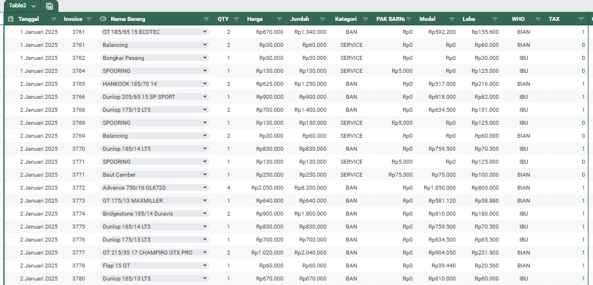
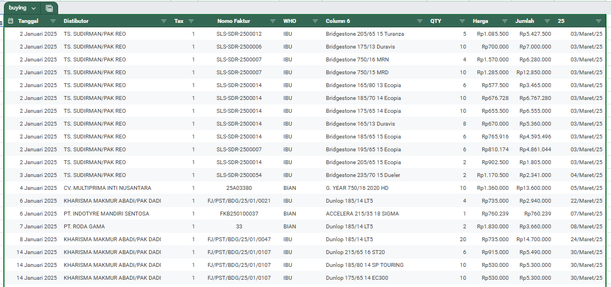
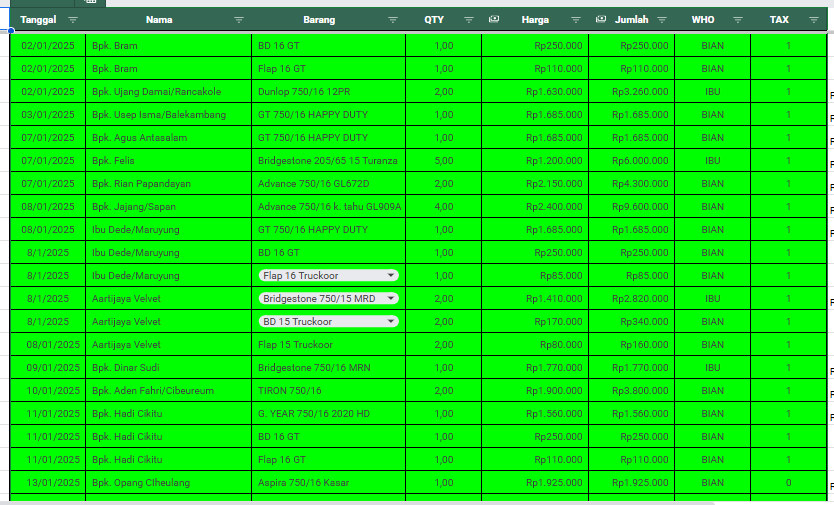
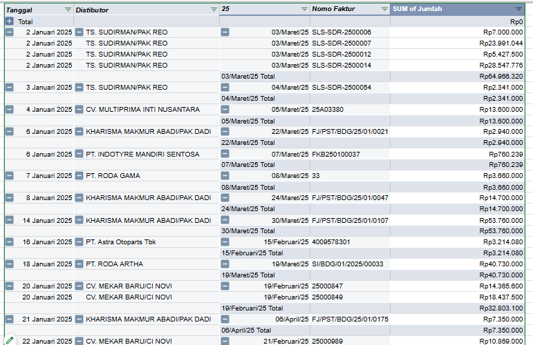
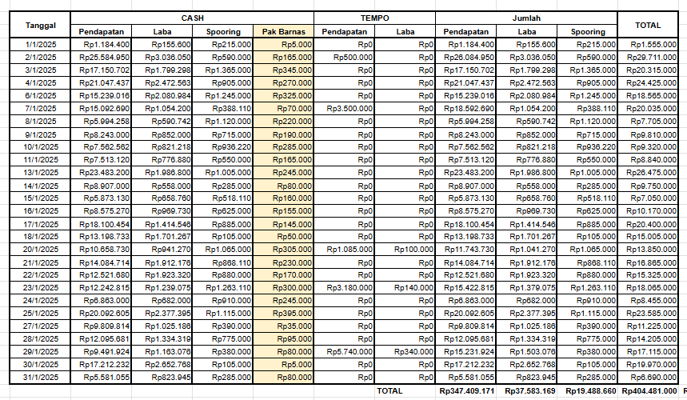
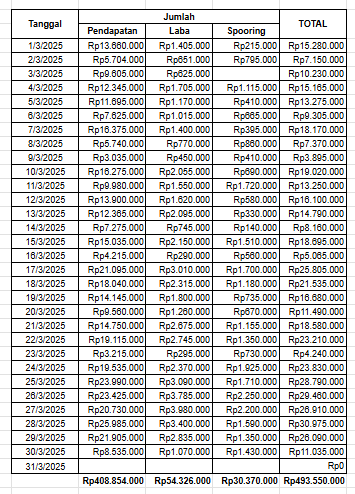

# Formulas Used

## Database


1. **In**: To dynamically calculate the total quantity of each purchased item, I implemented the `SUMIF` function. This formula checks the list of item names and sums the corresponding quantities only for the specified item.

   **Formula:** `=SUMIF(item_name_range, specific_item, quantity_range)`
   
   **Implementation:** `=SUMIF('BUYING 2025'!G:G, B2, 'BUYING 2025'!H:H)`

   | Argument | Role in This Context | Example |
   | :--- | :--- | :--- |
   | range/item_name_range | The list to search through. | 'BUYING 2025'!G:G |
   | criteria/specific_item | The specific item to total. | B2 |
   | sum_range/quantity_range | The values to add together. | 'BUYING 2025'!H:H |

   **Key Insight**: The `sum_range` is essential. Without it, Excel would attempt to sum the text values in the `item_name_range`, which would result in an error.

2. **Cash**: Tracks total items sold via cash payments. The value is dynamically calculated using a `SUMIF` formula that references data in the 'Selling' sheet.

   **Implementation:** `=SUMIF('SELLING'!D:D, B2, 'SELLING'!E:E)`

3. **Credit**: Tracks total items sold via credit payments, formula that references data in the 'Credit' sheet.

   **Implementation:** `=SUMIF('CREDIT'!D:D, B2, 'CREDIT'!E:E)`

4. **Final**: Stock of an item. The value is calculated using the formula: `=(Initial Stock + In) - (Goods Sold via Cash Sales + Credit Sales)`

   **Implementation:** `=(F2+M2)-(N2+O2)`

---

## Transaction


1. **Drop-down from a Range**
   
   This feature is used to create a dropdown list for selecting items or customers, ensuring data consistency and validation.
   
   - **Implementation**: `Insert` → `Dropdown` → `Dropdown (from a range)`
   - **Usage**: This feature can reference a range from a different sheet within the same workbook.

2. **VLOOKUP**
   
   The VLOOKUP function is used to automatically retrieve the cost price of an item from the database. Why it's used for cost, not selling price: The cost price from purchasing is fixed, making it ideal for a direct lookup. The selling price, however, may frequently change due to discounts, whereas purchase prices remain stable (unless there is a company-wide price increase).
   
   **Formula**: `=VLOOKUP(lookup_value, table_array, col_index_num, [range_lookup])`
   
   **Implementation Example**: `=VLOOKUP(D29, DATABASE!B:Q, 7, FALSE)`
   
   - **lookup_value**: The criteria to search for (e.g., the item name in cell D29).
   - **table_array**: The range of data to search within (DATABASE!B:Q).
   - **col_index_num**: The column number (within the table_array) that contains the value to return (e.g., 7 for the cost price column).
   - **range_lookup**: FALSE ensures an exact match is found.

3. **Google Apps Script Automation**
   
   Two custom buttons were created using Google Apps Script to automate data entry:

   - **"Add" Button**: Saves the input data to the target sheet and clears only the item input fields, keeping several fields for repeated entries.

     ```javascript
     function TambahSimpan() {
       var Sheet = SpreadsheetApp.getActiveSpreadsheet();
       var Shtinput = Sheet.getSheetByName("TRANSACTION");
       var Shtdb = Sheet.getSheetByName("SELLING");
     
       var date = Shtinput.getRange('D3').getValue();
       var invoice = Shtinput.getRange('D5').getValue();
       var item = Shtinput.getRange('D7').getValue();
       var qty = Shtinput.getRange('D9').getValue();
       var price = Shtinput.getRange('D11').getValue();
     
       var baris = Shtdb.getRange('O1').getValue();
       baris += 1;
       var rangeisi = Shtdb.getRange('B' + baris + ":F" + baris);
       rangeisi.setValues([[date, invoice, item, qty, price]]);
       bersihtambahsimpan();
     }
    
     function bersihtambahsimpan() {
       var Sheet = SpreadsheetApp.getActiveSpreadsheet();
       var Shtinput = Sheet.getSheetByName("TRANSACTION");
     
       Shtinput.getRange('D7').clearContent();
       Shtinput.getRange('D9').clearContent();
       Shtinput.getRange('D11').clearContent();
     }
     ```
  
      This script automates a simple data entry process in Google Sheets. It consists of two functions:
      
      1.  **`TambahSimpan()`**: This is the main function. It reads data from an input form, saves it to a database sheet, and then triggers a cleanup.
      2.  **`bersihtambahsimpan()`**: This is a helper function that clears the input form after data is saved, preparing it for the next entry.

      
          #### Line-by-Line Explanation: `TambahSimpan()`
          
          ```javascript
          function TambahSimpan() {
          ```
          *   Declares a function named `TambahSimpan`.
          
          ```javascript
          var Sheet = SpreadsheetApp.getActiveSpreadsheet();
          ```
          *   **`SpreadsheetApp.getActiveSpreadsheet()`**: Gets a reference to the currently active Google Sheets file.
          *   **`var Sheet`**: Stores that reference in a variable named `Sheet`. This variable now represents your entire spreadsheet file.
          
          ```javascript
          var Shtinput = Sheet.getSheetByName("TRANSACTION");
          var Shtdb = Sheet.getSheetByName("SELLING");
          ```
          *   **`getSheetByName()`**: Accesses a specific worksheet (tab) inside the spreadsheet by its name.
          *   **`var Shtinput`**: Stores a reference to the worksheet named `"TRANSACTION"`. This is the **input form** where users enter new data.
          *   **`var Shtdb`**: Stores a reference to the worksheet named `"SELLING"`. This is the **database** where all the records are stored.
          
          ```javascript
          var date = Shtinput.getRange('D3').getValue();
          var invoice = Shtinput.getRange('D5').getValue();
          var item = Shtinput.getRange('D7').getValue();
          var qty = Shtinput.getRange('D9').getValue();
          var price = Shtinput.getRange('D11').getValue();
          ```
          *   **`getRange('CELL_ADDRESS')`**: Selects a specific cell or range of cells. Here, it's selecting individual cells: `D3`, `D5`, `D7`, etc.
          *   **`.getValue()`**: Retrieves the value (text, number, date) contained in the specified cell.
          *   This block **reads data from the input form** and stores it in variables:
              *   `date` from cell `D3`
              *   `invoice` from cell `D5`
              *   `item` from cell `D7`
              *   `qty` (quantity) from cell `D9`
              *   `price` from cell `D11`
          
          ```javascript
          var baris = Shtdb.getRange('O1').getValue();
          baris += 1;
          ```
          *   This logic finds the next empty row in the database.
          *   **`var baris = Shtdb.getRange('O1').getValue();`**: Reads the value from cell **`O1`** in the `SELLING` sheet. Cell `O1` acts as a **counter**, storing the number of the last row that has data.
              *   *Example: If there are 10 records, `O1` likely contains the number `10`.*
          *   **`baris += 1;`**: This is shorthand for `baris = baris + 1;`. It increments the value of `baris` by 1. If `O1` was `10`, `baris` becomes `11`. This is the next available empty row.
          
          ```javascript
          var rangeisi = Shtdb.getRange('B' + baris + ":F" + baris);
          ```
          *   **Prepares the target range** where the new data will be written.
          *   It constructs a dynamic range reference by concatenating strings and the `baris` variable.
          *   If `baris` is `11`, this becomes: `Shtdb.getRange('B11:F11')`.
          *   This selects a horizontal range from **Column B to Column F on row 11**.
          
          ```javascript
          rangeisi.setValues([[date, invoice, item, qty, price]]);
          ```
          *   **`.setValues()`**: Writes an array of values into the specified range.
          *   **`[[date, invoice, item, qty, price]]`**: The argument for `setValues` must be a **2-dimensional array** (an array of rows, where each row is an array of cells).
              *   The outer square brackets `[ ... ]` represent the **list of rows**.
              *   The inner square brackets `[date, invoice, ...]` represent the **cells within that single row**.
          *   The data is written in the specified order: `B11=date`, `C11=invoice`, `D11=item`, `E11=qty`, `F11=price`.
          
          ```javascript
          bersihtambahsimpan();
          }
          ```
          *   **Calls the `bersihtambahsimpan()` function**. This executes the cleanup process after the data is successfully saved.
          *   The closing brace `}` marks the end of the `TambahSimpan()` function.
          
    
          
          #### Line-by-Line Explanation: `bersihtambahsimpan()`
      
          ```javascript
          function bersihtambahsimpan(){
          ```
          *   Declares a function named `bersihtambahsimpan`.
          
          ```javascript
          var Sheet = SpreadsheetApp.getActiveSpreadsheet();
          var Shtinput = Sheet.getSheetByName("TRANSACTION");
          ```
          *   Re-establishes references to the active spreadsheet and the `"TRANSACTION"` input sheet. (Note: These variables could have been passed from the main function to avoid repetition).
          
          ```javascript
          Shtinput.getRange('D7').clearContent();
          Shtinput.getRange('D9').clearContent();
          Shtinput.getRange('D11').clearContent();
          }
          ```
          *   **`.clearContent()`**: Clears the value (content) from a cell, but leaves any formatting (like colors or borders) intact.
          *   This block **clears the specific input fields** for `item` (`D7`), `qty` (`D9`), and `price` (`D11`). Notice it does *not* clear the `date` (`D3`) or `invoice` (`D5`), suggesting these might be auto-generated or not need to be changed every time.
          *   The closing brace `}` marks the end of the function.

   - **"Save" Button**: Saves the input data to the target sheet and clears only all item input fields, keeping date fields for repeated entries.

     ```javascript
     function Simpan() {
       var Sheet = SpreadsheetApp.getActiveSpreadsheet();
       var Shtinput = Sheet.getSheetByName("TRANSACTION");
       var Shtdb = Sheet.getSheetByName("SELLING");
          
       var date = Shtinput.getRange('D3').getValue();
       var invoice = Shtinput.getRange('D5').getValue();
       var item = Shtinput.getRange('D7').getValue();
       var qty = Shtinput.getRange('D9').getValue();
       var price = Shtinput.getRange('D11').getValue();
          
       var baris = Shtdb.getRange('O1').getValue();
       baris += 1;
       var rangeisi = Shtdb.getRange('B' + baris + ":F" + baris);
       rangeisi.setValues([[date, invoice, item, qty, price]]);
       bersih();
       }

     function bersih() {
      var Sheet = SpreadsheetApp.getActiveSpreadsheet();
      var Shtinput = Sheet.getSheetByName("TRANSACTION");
    
      Shtinput.getRange('D5').clearContent();
      Shtinput.getRange('D7').clearContent();
      Shtinput.getRange('D9').clearContent();
      Shtinput.getRange('D11').clearContent();
      }
     ```

      Actually, there is no significant difference between these two buttons. The difference lies only in a few fields that are not automatically cleared when using the Add button. Below is a detailed breakdown of the differences between Add and Save for each form:
      
      | Form | Add Button | Save Button |
      | :--- | :--- | :--- |
      | Cash | Clears fields except date and invoice number | Clears all except date |
      | Credit | Clears fields except customer name and date | Clears all except date |
      | Purchase | Clears fields except distributor, tax, invoice number, and WHO | Clears all except date |

     All Script for all button in Transaction Sheet

     ```javascript
      function Simpan() {
        var Sheet = SpreadsheetApp.getActiveSpreadsheet();
        var Shtinput = Sheet.getSheetByName("TRANSACTION");
        var Shtdb = Sheet.getSheetByName("SELLING");
      
        var date = Shtinput.getRange('D3').getValue();
        var invoice = Shtinput.getRange('D5').getValue();
        var item = Shtinput.getRange('D7').getValue();
        var qty = Shtinput.getRange('D9').getValue();
        var price = Shtinput.getRange('D11').getValue();
      
        var baris = Shtdb.getRange('O1').getValue();
        baris += 1;
        var rangeisi = Shtdb.getRange('B' + baris + ":F" + baris);
        rangeisi.setValues([[date, invoice, item, qty, price]]);
        bersih();
      }
      
      function TambahSimpan() {
        var Sheet = SpreadsheetApp.getActiveSpreadsheet();
        var Shtinput = Sheet.getSheetByName("TRANSACTION");
        var Shtdb = Sheet.getSheetByName("SELLING");
      
        var date = Shtinput.getRange('D3').getValue();
        var invoice = Shtinput.getRange('D5').getValue();
        var item = Shtinput.getRange('D7').getValue();
        var qty = Shtinput.getRange('D9').getValue();
        var price = Shtinput.getRange('D11').getValue();
      
        var baris = Shtdb.getRange('O1').getValue();
        baris += 1;
        var rangeisi = Shtdb.getRange('B' + baris + ":F" + baris);
        rangeisi.setValues([[date, invoice, item, qty, price]]);
        bersihtambahsimpan();
      }
      function bersihtambahsimpan(){
        var Sheet = SpreadsheetApp.getActiveSpreadsheet();
        var Shtinput = Sheet.getSheetByName("TRANSACTION");
      
        Shtinput.getRange('D7').clearContent();
        Shtinput.getRange('D9').clearContent();
        Shtinput.getRange('D11').clearContent();
      }
      
      function bersih() {
        var Sheet = SpreadsheetApp.getActiveSpreadsheet();
        var Shtinput = Sheet.getSheetByName("TRANSACTION");
      
        Shtinput.getRange('D5').clearContent();
        Shtinput.getRange('D7').clearContent();
        Shtinput.getRange('D9').clearContent();
        Shtinput.getRange('D11').clearContent();
      
      }
      
      function SimpanCredit() {
        var Sheet = SpreadsheetApp.getActiveSpreadsheet();
        var Shtinput = Sheet.getSheetByName("TRANSACTION");
        var Shtdb = Sheet.getSheetByName("CREDIT");
      
        var date = Shtinput.getRange('I3').getValue();
        var invoice = Shtinput.getRange('I5').getValue();
        var item = Shtinput.getRange('I7').getValue();
        var qty = Shtinput.getRange('I9').getValue();
        var price = Shtinput.getRange('I11').getValue();
      
        var baris = Shtdb.getRange('J1').getValue();
        baris += 1;
        var rangeisi = Shtdb.getRange('B' + baris + ":F" + baris);
        rangeisi.setValues([[date, invoice, item, qty, price]]);
        bersih2();
      }
      function TambahSimpanCredit() {
        var Sheet = SpreadsheetApp.getActiveSpreadsheet();
        var Shtinput = Sheet.getSheetByName("TRANSACTION");
        var Shtdb = Sheet.getSheetByName("CREDIT");
      
        var date = Shtinput.getRange('I3').getValue();
        var invoice = Shtinput.getRange('I5').getValue();
        var item = Shtinput.getRange('I7').getValue();
        var qty = Shtinput.getRange('I9').getValue();
        var price = Shtinput.getRange('I11').getValue();
      
        var baris = Shtdb.getRange('J1').getValue();
        baris += 1;
        var rangeisi = Shtdb.getRange('B' + baris + ":F" + baris);
        rangeisi.setValues([[date, invoice, item, qty, price]]);
        bersih2credit();
      }
      function bersih2credit() {
        var Sheet = SpreadsheetApp.getActiveSpreadsheet();
        var Shtinput = Sheet.getSheetByName("TRANSACTION");
      
        Shtinput.getRange('I7').clearContent();
        Shtinput.getRange('I9').clearContent();
        Shtinput.getRange('I11').clearContent();
      
      }
      function bersih2() {
        var Sheet = SpreadsheetApp.getActiveSpreadsheet();
        var Shtinput = Sheet.getSheetByName("TRANSACTION");
      
        Shtinput.getRange('I5').clearContent();
        Shtinput.getRange('I7').clearContent();
        Shtinput.getRange('I9').clearContent();
        Shtinput.getRange('I11').clearContent();
      
      }
      
      function SimpanCreditPaid() {
        var Sheet = SpreadsheetApp.getActiveSpreadsheet();
        var Shtinput = Sheet.getSheetByName("TRANSACTION");
        var Shtdb = Sheet.getSheetByName("CREDIT");
      
        var date = Shtinput.getRange('N3').getValue();
        var name = Shtinput.getRange('N5').getValue();
        var nominal = Shtinput.getRange('N7').getValue();
      
        var baris = Shtdb.getRange('V1').getValue();
        baris += 1;
        var rangeisi = Shtdb.getRange('Q' + baris + ":S" + baris);
        rangeisi.setValues([[date, name, nominal]]);
        bersih3();
      }
      function bersih3(){
        var Sheet = SpreadsheetApp.getActiveSpreadsheet();
        var Shtinput = Sheet.getSheetByName("TRANSACTION");
      
        Shtinput.getRange('N5').clearContent();
        Shtinput.getRange('N7').clearContent();
      }
      
      function SimpanItem() {
        var Sheet = SpreadsheetApp.getActiveSpreadsheet();
        var Shtinput = Sheet.getSheetByName("TRANSACTION");
        var Shtdb = Sheet.getSheetByName("BUYING 2025");
      
        var date = Shtinput.getRange('D19').getValue();
        var distributor = Shtinput.getRange('D21').getValue();
        var tax = Shtinput.getRange('D23').getValue();
        var factur = Shtinput.getRange('D25').getValue();
        var who = Shtinput.getRange('D27').getValue();
        var item = Shtinput.getRange('D29').getValue();
        var qty = Shtinput.getRange('D31').getValue();
        var price = Shtinput.getRange('D33').getValue();
      
        var baris = Shtdb.getRange('A1').getValue();
        baris += 1;
        var rangeisi = Shtdb.getRange('B' + baris + ":I" + baris);
        rangeisi.setValues([[date, distributor, tax, factur, who, item, qty, price]]);
        bersih4();
      }
      function bersih4() {
        var Sheet = SpreadsheetApp.getActiveSpreadsheet();
        var Shtinput = Sheet.getSheetByName("TRANSACTION");
      
        Shtinput.getRange('D21').clearContent();
        Shtinput.getRange('D23').clearContent();
        Shtinput.getRange('D25').clearContent();
        Shtinput.getRange('D27').clearContent();
        Shtinput.getRange('D29').clearContent();
        Shtinput.getRange('D31').clearContent();
      }
      
      function SimpanItemTambah() {
        var Sheet = SpreadsheetApp.getActiveSpreadsheet();
        var Shtinput = Sheet.getSheetByName("TRANSACTION");
        var Shtdb = Sheet.getSheetByName("BUYING 2025");
      
        var date = Shtinput.getRange('D19').getValue();
        var distributor = Shtinput.getRange('D21').getValue();
        var tax = Shtinput.getRange('D23').getValue();
        var factur = Shtinput.getRange('D25').getValue();
        var who = Shtinput.getRange('D27').getValue();
        var item = Shtinput.getRange('D29').getValue();
        var qty = Shtinput.getRange('D31').getValue();
        var price = Shtinput.getRange('D33').getValue();
        
        var baris = Shtdb.getRange('A1').getValue();
        baris += 1;
        var rangeisi = Shtdb.getRange('B' + baris + ":I" + baris);
        rangeisi.setValues([[date, distributor, tax, factur, who, item, qty, price]]);
        bersih4in();
      }
      function bersih4in() {
        var Sheet = SpreadsheetApp.getActiveSpreadsheet();
        var Shtinput = Sheet.getSheetByName("TRANSACTION");
      
        Shtinput.getRange('D29').clearContent();
        Shtinput.getRange('D31').clearContent();
      }
      
      function SalesPaid() {
        var Sheet = SpreadsheetApp.getActiveSpreadsheet();
        var Shtinput = Sheet.getSheetByName("TRANSACTION");
        var Shtdb = Sheet.getSheetByName("BUYING 2025");
      
        var date = Shtinput.getRange('I19').getValue();
        var name = Shtinput.getRange('I21').getValue();
        var nominal = Shtinput.getRange('I23').getValue();
      
        var baris = Shtdb.getRange('P1').getValue();
        baris += 1;
        var rangeisi = Shtdb.getRange('M' + baris + ":O" + baris);
        rangeisi.setValues([[date, name, nominal]]);
        bersih5();
      }
      
      function bersih5(){
        var Sheet = SpreadsheetApp.getActiveSpreadsheet();
        var Shtinput = Sheet.getSheetByName("TRANSACTION");
      
        Shtinput.getRange('I21').clearContent();
        Shtinput.getRange('I23').clearContent();
      }
      
      function cashout() {
        var Sheet = SpreadsheetApp.getActiveSpreadsheet();
        var Shtinput = Sheet.getSheetByName("TRANSACTION");
        var Shtdb = Sheet.getSheetByName("CASH OUT");
      
        var date = Shtinput.getRange('N19').getValue();
        var keterangan = Shtinput.getRange('N21').getValue();
        var nominal = Shtinput.getRange('N23').getValue();
      
        var baris = Shtdb.getRange('A1').getValue();
        baris += 1;
        var rangeisi = Shtdb.getRange('B' + baris + ":D" + baris);
        rangeisi.setValues([[date, keterangan, nominal]]);
        bersihcash6();
      }
      
      function bersihcash6(){
        var Sheet = SpreadsheetApp.getActiveSpreadsheet();
        var Shtinput = Sheet.getSheetByName("TRANSACTION");
      
        Shtinput.getRange('N21').clearContent();
        Shtinput.getRange('N23').clearContent();
      }
     ```
     
---
    
## Selling


Only the following inputs are entered directly into the Selling sheet: date, invoice number, item name, quantity, and selling price. The values for all other fields are populated automatically using Excel formulas.
  - **Total Price**: calculated using a simple multiplication formula:  ``` =[Quantity] * [Selling Price] ``` or ``` =F2*E2 ```

  - **Category, Service Fee, Cost, PIC (Who), and Tax**: these are automatically retrieved using the VLOOKUP function, which references a master data table.
      - Category: ``` =VLOOKUP(D2;DATABASE!B:P;11;FALSE) ```
      - Service fee/Pak Barnas: ``` =VLOOKUP(D2;DATABASE!B:P;10;FALSE) ```
      - COST/Modal: ``` =VLOOKUP(D2;DATABASE!B:P;7;FALSE) ```
      - WHO/PIC: ``` =VLOOKUP(D2;DATABASE!B:P;8;FALSE) ```
      - TAX: ``` =VLOOKUP(D2;DATABASE!B:P;9;FALSE) ```

  - **Profit/Laba**: calculated using an IF function to apply different business logic based on the item's category. ``` =IF(H2="BAN";G2-(J2*E2);G2-(J2+I2)) ```

---

## Buying


Almost all fields in the Buying sheet are automatically populated from the Transaction sheet. Only the total column, which uses the formula ``` =quantity * price ``` or ``` =H2*I2 ```, and the due date column are manual inputs. The due date is manual because the payment terms differ for each distributor.


## Credit


The Credit Sheet uses only a basic formula to calculate the total amount by multiplying the quantity by the price. ``` =quantity * price ``` or ``` =F2*E2 ```

## Loan


Uses a Pivot Table to organize accounts payable. The data source is the Buying sheet. Rows consist of date, distributor, due date, and invoice number. Values use the amount. The result displays the total debt amount for each invoice under each distributor.

## Report


1. Cash Payments:
      - REVENUE (Pendapatan): Total income minus tire profit, spooring income, and service fee. This is the shop's money used to buy goods from the distributor. ``` =sumif(SELLING!B:B;B4;SELLING!G:G)-(D4+E4+F4) ```
      - TIRE PROFIT (Laba): Profit from tire sales. ``` =SUMIFS(SELLING!K:K;SELLING!B:B;B4;SELLING!H:H;"BAN") ```
      - SPOORING INCOME (Spooring): Gross Income - Mechanic's Commission ``` =SUMIFS(SELLING!K:K;SELLING!B:B;B4;SELLING!H:H;"SERVICE") ```
      - SERVICE FEE (Service Fee): The amount to be paid to the mechanic for the spooring commission. ``` =SUMIF(SELLING!B:B;B4;SELLING!I:I) ```
2. Accounts Receivable Payments (Installment/Credit Payments):
      - REVENUE (Pendapatan): Total income minus tire profit. ``` =sumif(CREDIT!Q:Q;B4;CREDIT!S:S)-H4 ```
      - TIRE PROFIT (Laba): Profit from tire sales to customers who pay their debt. ``` =SUMIF(CREDIT!Q:Q;B4;CREDIT!T:T) ```
3. GRAND TOTAL (Jumlah):
      The sum of all cash and credit payments.
      - **REVENUE (Pendapatan)**: ``` =C4+G4 ```
      - **PROFIT**: ``` =D4+H4 ```
      - **SPOORING**: ``` =E4 ```
      - **TOTAL**: ``` =I4+J4+K4 ```

## FXED Report


Copying and pasting data from the Report sheet and then rounding the values to the nearest multiple of 5,000.


