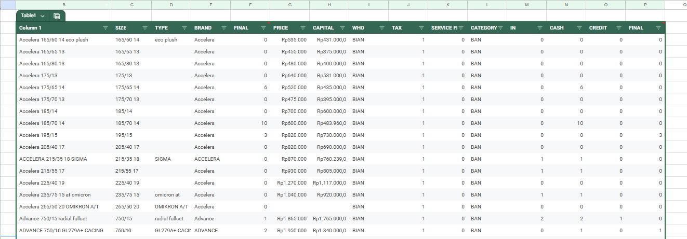

# Formulas Used

## Database



1. **In**: To dynamically calculate the total quantity of each purchased item, I implemented the `SUMIF` function. This formula checks the list of item names and sums the corresponding quantities only for the specified item.

   **Formula:** `=SUMIF(item_name_range, specific_item, quantity_range)`
   
   **Implementation:** `=SUMIF('BUYING 2025'!G:G, B2, 'BUYING 2025'!H:H)`

   | Argument | Role in This Context | Example |
   | :--- | :--- | :--- |
   | range/item_name_range | The list to search through. | 'BUYING 2025'!G:G |
   | criteria/specific_item | The specific item to total. | B2 |
   | sum_range/quantity_range | The values to add together. | 'BUYING 2025'!H:H |

   **Key Insight**: The `sum_range` is essential. Without it, Excel would attempt to sum the text values in the `item_name_range`, which would result in an error.

2. **Cash**: Tracks total items sold via cash payments. The value is dynamically calculated using a `SUMIF` formula that references data in the 'Selling' sheet.

   **Implementation:** `=SUMIF('SELLING'!D:D, B2, 'SELLING'!E:E)`

3. **Credit**: Tracks total items sold via credit payments, formula that references data in the 'Credit' sheet.

   **Implementation:** `=SUMIF('CREDIT'!D:D, B2, 'CREDIT'!E:E)`

4. **Final**: Stock of an item. The value is calculated using the formula: `=(Initial Stock + In) - (Goods Sold via Cash Sales + Credit Sales)`

   **Implementation:** `=(F2+M2)-(N2+O2)`

---

## Transaction


1. **Drop-down from a Range**
   
   This feature is used to create a dropdown list for selecting items or customers, ensuring data consistency and validation.
   
   - **Implementation**: `Insert` → `Dropdown` → `Dropdown (from a range)`
   - **Usage**: This feature can reference a range from a different sheet within the same workbook.

2. **VLOOKUP**
   
   The VLOOKUP function is used to automatically retrieve the cost price of an item from the database. Why it's used for cost, not selling price: The cost price from purchasing is fixed, making it ideal for a direct lookup. The selling price, however, may frequently change due to discounts, whereas purchase prices remain stable (unless there is a company-wide price increase).
   
   **Formula**: `=VLOOKUP(lookup_value, table_array, col_index_num, [range_lookup])`
   
   **Implementation Example**: `=VLOOKUP(D29, DATABASE!B:Q, 7, FALSE)`
   
   - **lookup_value**: The criteria to search for (e.g., the item name in cell D29).
   - **table_array**: The range of data to search within (DATABASE!B:Q).
   - **col_index_num**: The column number (within the table_array) that contains the value to return (e.g., 7 for the cost price column).
   - **range_lookup**: FALSE ensures an exact match is found.

3. **Google Apps Script Automation**
   
   Two custom buttons were created using Google Apps Script to automate data entry:

   - **"Add" Button**: Saves the input data to the target sheet and clears only the item input fields, keeping several fields for repeated entries.

     ```javascript
     function TambahSimpan() {
       var Sheet = SpreadsheetApp.getActiveSpreadsheet();
       var Shtinput = Sheet.getSheetByName("TRANSACTION");
       var Shtdb = Sheet.getSheetByName("SELLING");
     
       var date = Shtinput.getRange('D3').getValue();
       var invoice = Shtinput.getRange('D5').getValue();
       var item = Shtinput.getRange('D7').getValue();
       var qty = Shtinput.getRange('D9').getValue();
       var price = Shtinput.getRange('D11').getValue();
     
       var baris = Shtdb.getRange('O1').getValue();
       baris += 1;
       var rangeisi = Shtdb.getRange('B' + baris + ":F" + baris);
       rangeisi.setValues([[date, invoice, item, qty, price]]);
       bersihtambahsimpan();
     }
    
     function bersihtambahsimpan() {
       var Sheet = SpreadsheetApp.getActiveSpreadsheet();
       var Shtinput = Sheet.getSheetByName("TRANSACTION");
     
       Shtinput.getRange('D7').clearContent();
       Shtinput.getRange('D9').clearContent();
       Shtinput.getRange('D11').clearContent();
     }
     ```
  
      This script automates a simple data entry process in Google Sheets. It consists of two functions:
      
      1.  **`TambahSimpan()`**: This is the main function. It reads data from an input form, saves it to a database sheet, and then triggers a cleanup.
      2.  **`bersihtambahsimpan()`**: This is a helper function that clears the input form after data is saved, preparing it for the next entry.

      
          #### Line-by-Line Explanation: `TambahSimpan()`
          
          ```javascript
          function TambahSimpan() {
          ```
          *   Declares a function named `TambahSimpan`.
          
          ```javascript
          var Sheet = SpreadsheetApp.getActiveSpreadsheet();
          ```
          *   **`SpreadsheetApp.getActiveSpreadsheet()`**: Gets a reference to the currently active Google Sheets file.
          *   **`var Sheet`**: Stores that reference in a variable named `Sheet`. This variable now represents your entire spreadsheet file.
          
          ```javascript
          var Shtinput = Sheet.getSheetByName("TRANSACTION");
          var Shtdb = Sheet.getSheetByName("SELLING");
          ```
          *   **`getSheetByName()`**: Accesses a specific worksheet (tab) inside the spreadsheet by its name.
          *   **`var Shtinput`**: Stores a reference to the worksheet named `"TRANSACTION"`. This is the **input form** where users enter new data.
          *   **`var Shtdb`**: Stores a reference to the worksheet named `"SELLING"`. This is the **database** where all the records are stored.
          
          ```javascript
          var date = Shtinput.getRange('D3').getValue();
          var invoice = Shtinput.getRange('D5').getValue();
          var item = Shtinput.getRange('D7').getValue();
          var qty = Shtinput.getRange('D9').getValue();
          var price = Shtinput.getRange('D11').getValue();
          ```
          *   **`getRange('CELL_ADDRESS')`**: Selects a specific cell or range of cells. Here, it's selecting individual cells: `D3`, `D5`, `D7`, etc.
          *   **`.getValue()`**: Retrieves the value (text, number, date) contained in the specified cell.
          *   This block **reads data from the input form** and stores it in variables:
              *   `date` from cell `D3`
              *   `invoice` from cell `D5`
              *   `item` from cell `D7`
              *   `qty` (quantity) from cell `D9`
              *   `price` from cell `D11`
          
          ```javascript
          var baris = Shtdb.getRange('O1').getValue();
          baris += 1;
          ```
          *   This logic finds the next empty row in the database.
          *   **`var baris = Shtdb.getRange('O1').getValue();`**: Reads the value from cell **`O1`** in the `SELLING` sheet. Cell `O1` acts as a **counter**, storing the number of the last row that has data.
              *   *Example: If there are 10 records, `O1` likely contains the number `10`.*
          *   **`baris += 1;`**: This is shorthand for `baris = baris + 1;`. It increments the value of `baris` by 1. If `O1` was `10`, `baris` becomes `11`. This is the next available empty row.
          
          ```javascript
          var rangeisi = Shtdb.getRange('B' + baris + ":F" + baris);
          ```
          *   **Prepares the target range** where the new data will be written.
          *   It constructs a dynamic range reference by concatenating strings and the `baris` variable.
          *   If `baris` is `11`, this becomes: `Shtdb.getRange('B11:F11')`.
          *   This selects a horizontal range from **Column B to Column F on row 11**.
          
          ```javascript
          rangeisi.setValues([[date, invoice, item, qty, price]]);
          ```
          *   **`.setValues()`**: Writes an array of values into the specified range.
          *   **`[[date, invoice, item, qty, price]]`**: The argument for `setValues` must be a **2-dimensional array** (an array of rows, where each row is an array of cells).
              *   The outer square brackets `[ ... ]` represent the **list of rows**.
              *   The inner square brackets `[date, invoice, ...]` represent the **cells within that single row**.
          *   The data is written in the specified order: `B11=date`, `C11=invoice`, `D11=item`, `E11=qty`, `F11=price`.
          
          ```javascript
          bersihtambahsimpan();
          }
          ```
          *   **Calls the `bersihtambahsimpan()` function**. This executes the cleanup process after the data is successfully saved.
          *   The closing brace `}` marks the end of the `TambahSimpan()` function.
          
    
          
          #### Line-by-Line Explanation: `bersihtambahsimpan()`
      
          ```javascript
          function bersihtambahsimpan(){
          ```
          *   Declares a function named `bersihtambahsimpan`.
          
          ```javascript
          var Sheet = SpreadsheetApp.getActiveSpreadsheet();
          var Shtinput = Sheet.getSheetByName("TRANSACTION");
          ```
          *   Re-establishes references to the active spreadsheet and the `"TRANSACTION"` input sheet. (Note: These variables could have been passed from the main function to avoid repetition).
          
          ```javascript
          Shtinput.getRange('D7').clearContent();
          Shtinput.getRange('D9').clearContent();
          Shtinput.getRange('D11').clearContent();
          }
          ```
          *   **`.clearContent()`**: Clears the value (content) from a cell, but leaves any formatting (like colors or borders) intact.
          *   This block **clears the specific input fields** for `item` (`D7`), `qty` (`D9`), and `price` (`D11`). Notice it does *not* clear the `date` (`D3`) or `invoice` (`D5`), suggesting these might be auto-generated or not need to be changed every time.
          *   The closing brace `}` marks the end of the function.

   - **"Save" Button**: Saves the input data to the target sheet and clears only all item input fields, keeping date fields for repeated entries.

     ```javascript
     function Simpan() {
       var Sheet = SpreadsheetApp.getActiveSpreadsheet();
       var Shtinput = Sheet.getSheetByName("TRANSACTION");
       var Shtdb = Sheet.getSheetByName("SELLING");
          
       var date = Shtinput.getRange('D3').getValue();
       var invoice = Shtinput.getRange('D5').getValue();
       var item = Shtinput.getRange('D7').getValue();
       var qty = Shtinput.getRange('D9').getValue();
       var price = Shtinput.getRange('D11').getValue();
          
       var baris = Shtdb.getRange('O1').getValue();
       baris += 1;
       var rangeisi = Shtdb.getRange('B' + baris + ":F" + baris);
       rangeisi.setValues([[date, invoice, item, qty, price]]);
       bersih();
       }

     function bersih() {
      var Sheet = SpreadsheetApp.getActiveSpreadsheet();
      var Shtinput = Sheet.getSheetByName("TRANSACTION");
    
      Shtinput.getRange('D5').clearContent();
      Shtinput.getRange('D7').clearContent();
      Shtinput.getRange('D9').clearContent();
      Shtinput.getRange('D11').clearContent();
      }
     ```

      Actually, there is no significant difference between these two buttons. The difference lies only in a few fields that are not automatically cleared when using the Add button. Below is a detailed breakdown of the differences between Add and Save for each form:
      
      | Form | Add Button | Save Button |
      | :--- | :--- | :--- |
      | Cash | Clears fields except date and invoice number | Clears all except date |
      | Credit | Clears fields except customer name and date | Clears all except date |
      | Purchase | Clears fields except distributor, tax, invoice number, and WHO | Clears all except date |
    
---
    
## Selling
*(Content for Selling section)*

---

## Buying
*(Content for Buying section)*

## Credit
*(Content for Credit section)*

## Loan
*(Content for Loan section)*

## Report
*(Content for Report section)*
