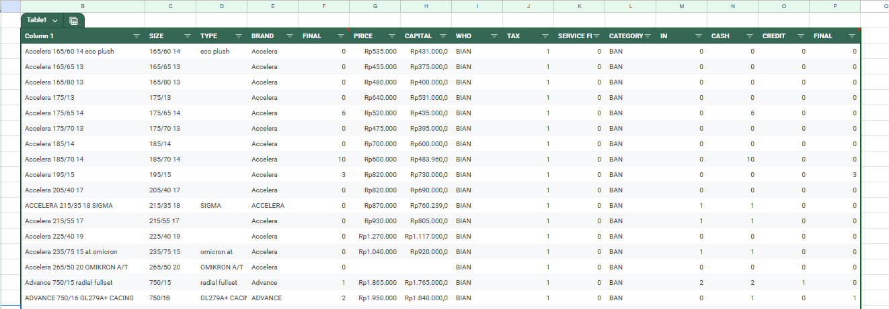

# sales-information-system-V1
To support work efficiency, I've designed a simple information system using spreadsheets to aid in data processing. This system is customized to meet my requirements as an administrator at my present company.

## The formula used in this system
- IFS
- Sumif
- Vlookup
- Pivot Tabel
- Appscript

## This information system contains several sheets
1. Database
2. Transaction
3. Selling
4. Buying
5. Credit
6. Loan
7. Report
8. Fixed Report

### Let's break down this system
  <b> 1. Database </b>
       
     
     
Databases are one of the most important components of an information system. This database contains articles, each of which has several identifying attributes.
